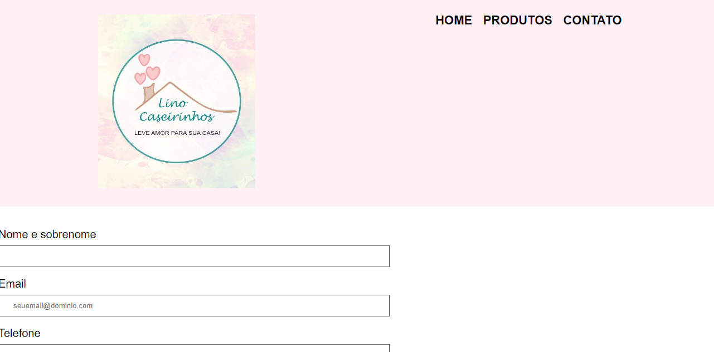

# Desenvolvendo Página da Confeitaria Lino Caseirinhos!

#### Nesta página você irá conhecer um pouco da história da Lino Caseirinhos, quando e como ela surgiu e conhecer os produtos mais amados por seus clientes.

## Layout do projeto:

      

## Projeto criado por:

---

## Contato

## Linguagens

